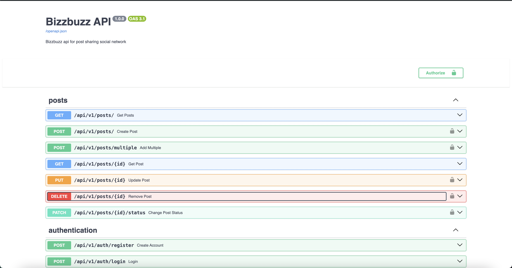

# bizzbuzz-fastapi

BizzBuzz API, a makeshift social media application that allows user to create long post messages.

## Endpoint documentation

[Swagger Documentation](http://localhost:8000/docs "BizzBuzz FastAPI Swagger Documentation") 
[Redocs Documentation](http://localhost:8000/redoc "BizzBuzz FastAPI Redoc Documentation") 

## Requirements

- You must be using at least Python 3.6

## Set up

1. Clone the project in your local computer
2. Create a virtualenv file
3. Terminal/CLI command: <code>pip install --upgrade pip</code> to update your pip version
4. Install all dependencies with <code>pip install -r requirements.txt</code>
5. Run <code>uvicorn main:app</code> to start the server.

## Dependencies

### Main dependencies

[FastAPI](https://fastapi.tiangolo.com "fastAPI") for api server 
[Uvicorn](https://www.uvicorn.org/ "uvicorn") - lightweight ASGI server 
[Pydantic](https://pydantic-docs.helpmanual.io/ "pydantic docs") to create schemas (comes with FastAPI by default) 
[Swagger UI](https://swagger.io/ "swagger ui website") for API documentation (embedded in FastAPI by default) 
[Redocs](https://redoc.ly/ "Redocly website") - alternative API documentation (embedded in FastAPI by default) 
[SQLAlchemy](https://www.sqlalchemy.org/ "SQLAlchemy") - database orm for interacting with SQL database 
[Bcrypt](https://pypi.org/project/bcrypt/ "bcrypt") - for password hashing 
[PyJWT](https://pyjwt.readthedocs.io/en/stable/ "PyJWT documentation") - for generating jwt tokens used for user authentication  

### Dev dependencies

[Black](https://black.readthedocs.io/en/stable/ "black") for code formatting

## Routes

### Authentication routes <code>/auth/\*</code>

- **POST** <code>/auth/register</code> registers a new user
- **POST** <code>/auth/login</code> logins a user using either the username or email and password

### Posts routes <code>/posts</code>

- **GET** <code>/posts</code> gets post (can also take "search" and "status" query parameter)
- **POST** <code>/posts</code> adds a new post \*
- **GET** <code>/posts/{postId}</code> gets a post by id
- **PUT** <code>/posts/{postId}</code> updates a post that matches an id \* \*\*
- **PATCH** <code>/posts/{postId}/status</code> updates the status of a post that matches an id \* \*\*
- **DELETE** <code>/posts/{postId}</code> deletes a post from database \* \*\*

<code>*</code> *requires jwt token on Authorization header of request*  
<code>\*\*</code> *requires that user is the author of post/like/reply\*

## Contribution

When contributing to this repository, please first discuss the change you wish to make via issue, email, or any other method with the owners of this repository before making a change.

Please note we have a code of conduct, please follow it in all your interactions with the project.

## Pull Request Process

1. Ensure any install or build dependencies are removed before the end of the layer when doing a build.
2. Update the [README.md](/README.md "README.md") with details of changes to the interface, this includes new environment variables, exposed ports, useful file locations and container parameters.
3. Make all pull requests of new features to the **develop** branch so it can be project
